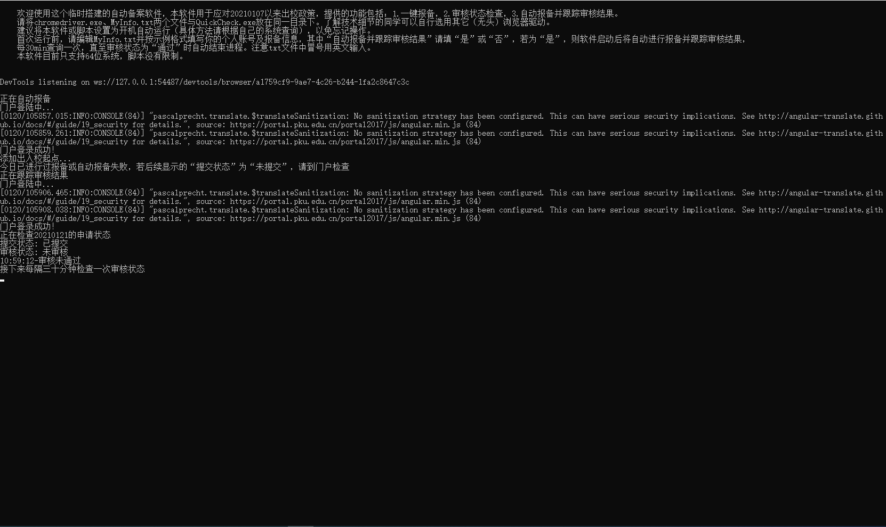
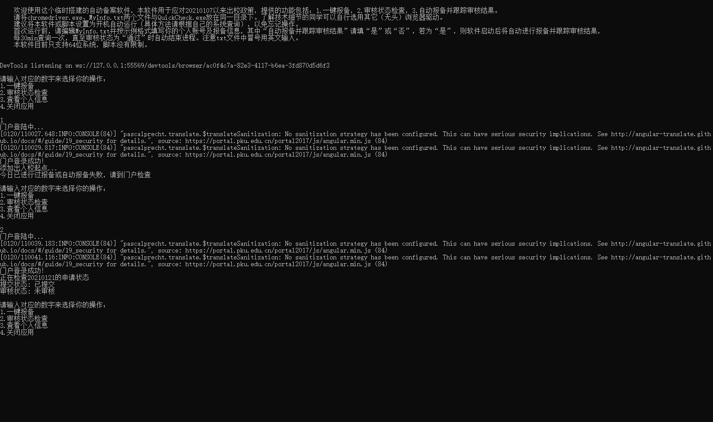

### **PKU_CheckOut**
# 用于北大2021.1.7至2021.3.8期间往返畅春园的一键报备

# **停用**

为避免自动报备导致少数同学不及时更改行程信息，本人积极主动下架项目，大家多多相互提醒记得报备就好。在此撤除MyInfo.txt和chromedriver.exe文件并删除源码中的学校网站细节，以保证代码无法运行，仅保留编程框架作为selenium项目的学习参考。本项目原意为节省在浏览器上填表的时间及避免忘记报备，凡衍生品其法律责任由修改及使用者承担。

## **背景**

本项目受[Bruuuuuuce/PKUAutoSubmit](https://github.com/Bruuuuuuce/PKUAutoSubmit)启发，一方面为了学习selenium，一方面为了方便日常报备。原项目中**login**部分几乎照搬，余下部分均有不同，一些因网页结构变化，一些因代码逻辑习惯差别。由于selenium不再维护phantomJS，本项目采用chromedriver并默认设置为无头模式。

## **功能**

欢迎使用这个临时搭建的自动备案软件，本软件用于应对20210107以来出校政策，提供的功能包括：1.一键报备，2.审核状态检查，3.自动报备并跟踪审核结果。

请将chromedriver.exe、MyInfo.txt这两个文件与QuickCheck.py或QuickCheck.exe放在同一目录下。了解技术细节的同学可以自行选用其它（无头）浏览器驱动。其他电脑系统的同学请下载相应的chrome驱动。

建议将本软件或脚本设置为开机自动运行（具体方法请根据自己的系统查询），以免忘记操作。

首次运行前，请编辑MyInfo.txt并按示例格式填写你的个人账号及报备信息，其中“自动报备并跟踪审核结果”请填“是”或“否”，若为“是”，则软件启动后将自动进行报备并跟踪审核结果，每30min查询一次，直至审核状态为“通过”时自动结束进程。注意txt文件中冒号用英文输入。

本软件目前只支持64位系统，脚本没有限制。

自动效果：

手动效果：

